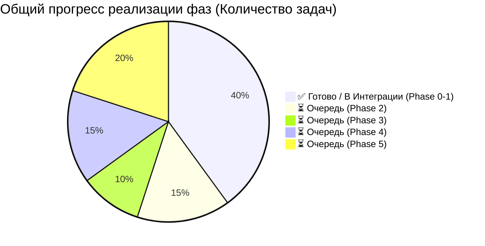
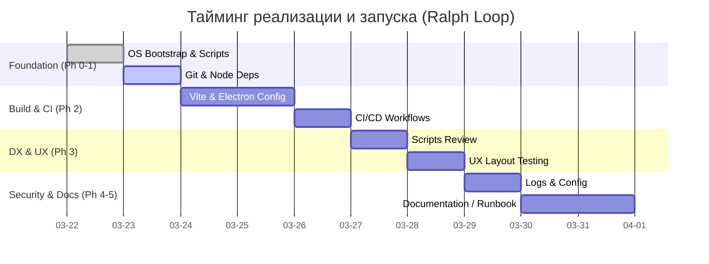

# Shadow Stack Orchestrator Phases (Cycle 1 / 6)

Данный документ описывает структуру фаз и задач (Phase/Task Map) для `shadow-stack-orchestrator`.
Все задачи сгруппированы с учетом 15 факторов Anti-Gravity.
Этот файл является единым источником правды для определения статуса "Здоровья" проекта.

## Текущий цикл Ralph Loop: 6 из 6 (Documentation & Validation)
**Статус:** Оркестратор тестируется (все 6 циклов). Скрипты для факторов 1–5 развернуты.

## 📊 Графический трекинг проекта (Project Status & Timings)





## Архитектура Оркестратора

```mermaid
flowchart TD
    UI[Orchestrator UI\n(Bootstrap / Phases)] --> IPC((Electron IPC))
    IPC -- "orchestrator:runTask" --> Main[Main Process\nTask Runner]
    Main --> Phase0[Phase 0: Mac Bootstrap]
    Main --> Phase1[Phase 1: Environment]
    Main --> Phase2[Phase 2: CI/CD & Build]
    Main --> Phase3[Phase 3: DX & UX]
    Main --> Phase4[Phase 4: Support]
    Main --> Phase5[Phase 5: Docs]
    
    subgraph Event Stream
    Main -- "orchestrator:log" --> UI
    Main -- "orchestrator:progress" --> UI
    end
```

---

## 🚦 План проверок и валидации

### Phase 0: Mac / Host Bootstrap (Factor: 1)

**Статус:** 🟢 **[DONE]** Скрипты реализованы.  
**Расчётное время запуска:** ~2-3 минуты.

| Task ID | Тип | Статус выполнения | Тайминг | Цель проверки |
|---|---|---|---|---|
| `0.foundation.scan` | `auto (health)` | ✅ DONE | 5s | Проверяет ОС, архитектуру (ARM64/x86), наличие базовых бинарников |
| `0.mac.bootstrap.xcode` | `auto` | ✅ DONE | 1-2m | Установка Command Line Tools (xcode-select) |
| `0.mac.bootstrap.brew` | `auto` | ✅ DONE | 1m | Установка Homebrew, если отсутствует |
| `0.mac.performance.ping`| `auto (health)` | ✅ DONE | 2s | (Factor 12) Базовый чек ресурсов (RAM/CPU) перед стартом |

### Phase 1: Environment & Repositories (Factors: 2, 3, 5)

**Статус:** 🟡 **[IN_PROGRESS]** Скрипты реализованы и интегрируются.  
**Расчётное время запуска:** ~3-5 минут.

| Task ID | Тип | Статус выполнения | Тайминг | Цель проверки |
|---|---|---|---|---|
| `1.repos.clone` | `auto` | ✅ DONE | 30s | Клон необходимых суб-репозиториев |
| `1.git.hygiene_check` | `auto (health)` | ✅ DONE | 5s | Линтинг веток, проверка `.gitignore` |
| `1.node.install_deps` | `auto` | 🔄 IN_PROG | 2m | Установка npm зависимостей |
| `1.env.check_dotenv` | `manual (health)`| 🔄 IN_PROG | 1m | Проверка `.env` и секретов DOPPLER |

### Phase 2: Build, CI/CD & GitOps (Factors: 4, 8)

**Статус:** 🔴 **[TODO]** Очередь.  
**Расчётное время запуска:** ~5-10 минут.

| Task ID | Тип | Статус выполнения | Тайминг | Цель проверки |
|---|---|---|---|---|
| `2.ci.files_present` | `auto` | ⏳ TODO | 10s | Наличие CI workflows (GitHub Actions) |
| `2.build.vite_check` | `auto` | ⏳ TODO | 2-3m | Проверка сборки UI виджета (`npm run build`) |
| `2.gitops.describe_flow`| `manual` | ⏳ TODO | 5m | Описание процессов деплоя |

### Phase 3: DX & Orchestrator UX (Factors: 6, 7, 13)

**Статус:** 🔴 **[TODO]** Очередь.  
**Расчётное время запуска:** ~5 минут.

| Task ID | Тип | Статус выполнения | Тайминг | Цель проверки |
|---|---|---|---|---|
| `3.dx.scripts_review` | `auto/manual` | ⏳ TODO | 2m | Ревью `package.json` скриптов |
| `3.ux.phases_layout_review`| `manual (health)`| ⏳ TODO | 3m | Оценка понятности Bootstrap/Phases UI |

### Phase 4: Observability, Resilience & Security (Factors: 9, 10, 11)

**Статус:** 🔴 **[TODO]** Очередь.  
**Расчётное время запуска:** ~10 минут.

| Task ID | Тип | Статус выполнения | Тайминг | Цель проверки |
|---|---|---|---|---|
| `4.logs.format` | `auto` | ⏳ TODO | 1m | Валидация структуры `orchestrator:log` событий |
| `4.resilience.retry_policy`| `manual (health)`| ⏳ TODO | 5m | Правила retry для Failed задач |
| `4.security.tokens_policy` | `manual` | ⏳ TODO | 4m | Политика хранения секретов, проверка отсутствия хардкода |

### Phase 5: Documentation & Lock-In (Factors: 14, 15)

**Статус:** 🔴 **[TODO]** Очередь.  
**Расчётное время запуска:** ~15-20 минут.

| Task ID | Тип | Статус выполнения | Тайминг | Цель проверки |
|---|---|---|---|---|
| `5.docs.phases` | `manual (health)`| 🔄 IN_PROG | 5m | Ревизия файла `PHASES.md` |
| `5.docs.agents` | `manual` | ⏳ TODO | 5m | Ревизия `AGENTS.md` |
| `5.docs.runbook` | `manual` | ⏳ TODO | 10m | Создание `RUNBOOK.md` для запуска с нуля |
| `5.extensibility.check` | `manual` | ⏳ TODO | 2m | Проверка легкости добавления новых задач в UI |

---

## 🛠 Заметки и Планы следующих шагов
- **Сделано (Done):** Подготовлены скрипты проверки Mac (Phase 0), клонирования и базовой валидации. В `PHASES.md` добавлена визуализация и прогресс.
- **Доделать (To-Do):** Связать хэндлеры процессов `npm install` и проверки секретов (Phase 1) через IPC с UI. Настроить Vite-конфиги сборки виджета и CI/CD пайплайны (Phase 2).
- **Общий Тайминг:** При исправной работе скриптов, полный `Bootstrap` проекта оркестратором с нуля займет машинного времени **~15-20 минут**.
