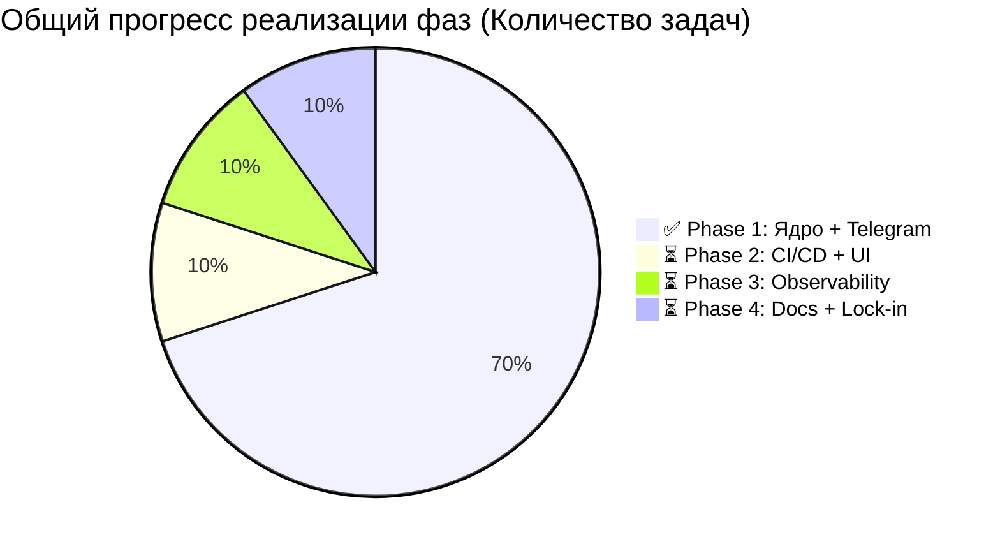
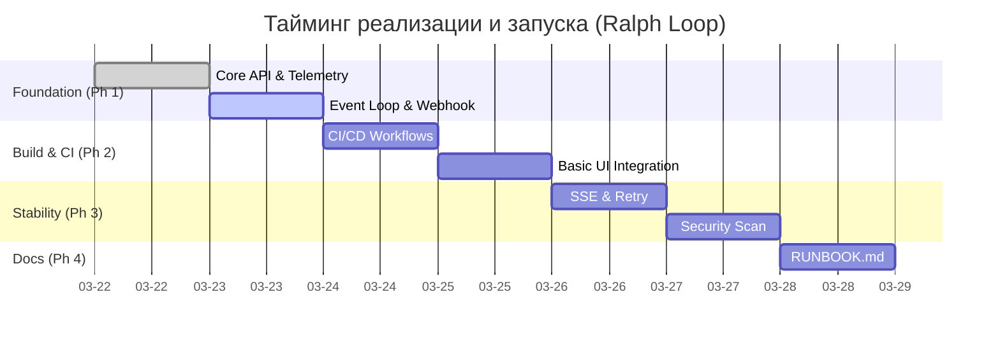
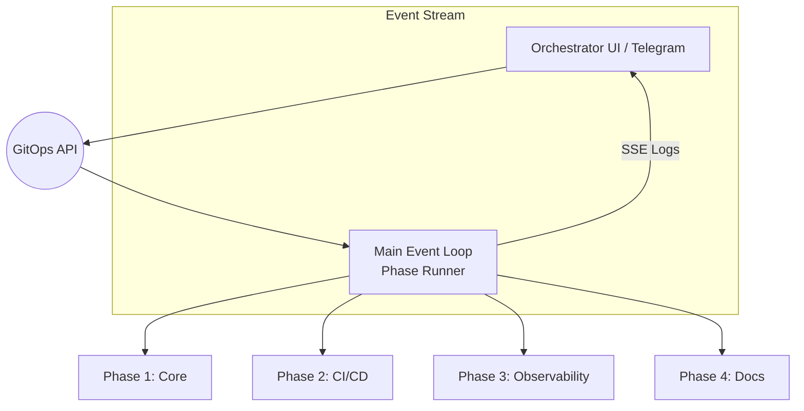

# Shadow Stack Orchestrator Phases (Cycle 1 / 6)

Данный документ описывает структуру фаз и задач (Phase/Task Map) для `shadow-stack-orchestrator`.
Все задачи сгруппированы с учетом 15 факторов Anti-Gravity.
Этот файл является единым источником правды для определения статуса "Здоровья" проекта.

## Текущий цикл Ralph Loop: 6 из 6 (Documentation & Validation)
**Статус:** Оркестратор тестируется (все 6 циклов). Скрипты для факторов 1–5 развернуты.

## 📊 Графический трекинг проекта (4 Фазы)

## Архитектура Оркестратора

---

## 🚦 План проверок и валидации

### Phase 1: Ядро + Telegram (Event Loop, Webhook, .env check)

**Статус:** 🟡 **[70% DONE]** Baseline (API/GitOps) готов.  
**Расчётное время запуска:** ~2-3 минуты.

| Task ID | Тип | Статус выполнения | Тайминг | Цель проверки |
| :--- | :--- | :--- | :--- | :--- |
| `1.baseline.api` | `auto` | ✅ DONE | 10s | GitOps API (v0, v1, ESM, Telemetry) работает |
| `1.event.loop` | `auto` | 🔄 IN_PROG | 2m | Связь `/api/orchestrator` с состояниями |
| `1.telegram.webhook` | `auto` | ⏳ TODO | 1m | Интеграция команд Телеграм |
| `1.env.check` | `manual (health)` | ⏳ TODO | 1m | Валидация .env секретов (без экспорта значений) |

### Phase 2: CI/CD + UI (GitHub Actions, Vercel, Basic UI)

**Статус:** 🔴 **[TODO]** Очередь.  
**Расчётное время запуска:** ~5-10 минут.

| Task ID | Тип | Статус выполнения | Тайминг | Цель проверки |
| :--- | :--- | :--- | :--- | :--- |
| `2.ci.github_actions` | `auto` | ⏳ TODO | 10s | Наличие и настройка CI пайплайнов GitHub Actions |
| `2.deploy.vercel` | `auto` | ⏳ TODO | 2-3m | Интеграция Vercel + Doppler автоматического деплоя |
| `2.ui.basic_phases` | `manual` | ⏳ TODO | 5m | Базовый UI Оркестратора в Next.js (без Electron) |

### Phase 3: Observability & Security (SSE Logs, Retry, Security Scan)

**Статус:** 🔴 **[TODO]** Очередь.  
**Расчётное время запуска:** ~5 минут.

| Task ID | Тип | Статус выполнения | Тайминг | Цель проверки |
| :--- | :--- | :--- | :--- | :--- |
| `3.logs.sse` | `auto` | ⏳ TODO | 2m | Структурирование потока логов в UI (SSE) |
| `3.resilience.retry` | `auto` | ⏳ TODO | 3m | Политика повторных попыток (Retry Policy) |
| `3.security.scan` | `auto (health)` | ⏳ TODO | 3m | Тесты безопасности (Secret Scanner + Tokens policy) |

### Phase 4: Docs & Lock-In (RUNBOOK.md, Custom Phases)

**Статус:** 🔴 **[TODO]** Очередь.  
**Расчётное время запуска:** ~15-20 минут.

| Task ID | Тип | Статус выполнения | Тайминг | Цель проверки |
| :--- | :--- | :--- | :--- | :--- |
| `4.docs.phases` | `manual (health)` | ✅ DONE | 5m | Актуализация `PHASES.md` под 4 фазы |
| `4.docs.runbook` | `manual` | ⏳ TODO | 10m | Создание `RUNBOOK.md` для запуска с нуля |
| `4.extensibility.check` | `manual` | ⏳ TODO | 2m | Тестирование Custom Phases |

---

## 🛠 Заметки и Текущие шаги (Phase 1 Finish)

1. Написать Telegram handler и Event Loop код.
2. Добавить скрипт `npm run orchestrator:start`.
3. Закоммитить baseline обновлённого `PHASES.md` и плана.
4. Пройти Ralph Loop Cycle 1.

